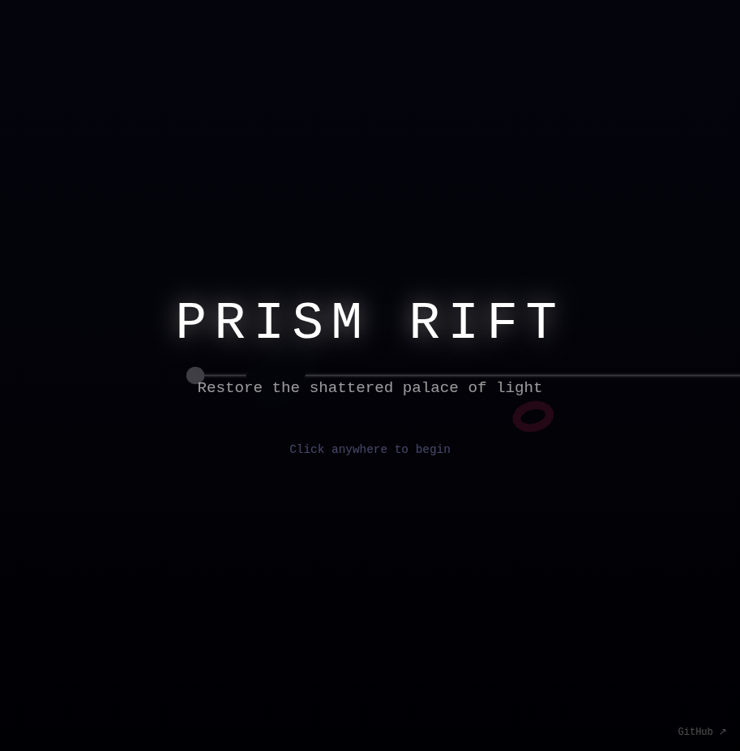

# Prism Rift

Restore the shattered palace of light.

An optics puzzle game where you must redirect scattered light beams through rotating crystal prisms to their matching color receptors. Drag prisms to rotate them and align the beams—connect all colors simultaneously to restore the palace before it goes dark.

## How to Play

- **Drag** on the prisms to rotate them
- White light splits into spectral colors (red, green, blue, violet) when passing through prisms
- **Connect** each colored beam to its matching receptor
- All receptors must be lit simultaneously to complete each level
- Progress through increasingly complex levels with more prisms and receptors

## Built With

- [Three.js r183](https://threejs.org/)
- [Tone.js v15.1.22](https://tonejs.github.io/)

## Links

- **Play:** https://nishivector.github.io/prism-rift/
- **Repo:** https://github.com/nishivector/prism-rift
